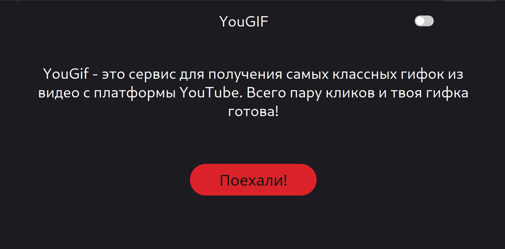
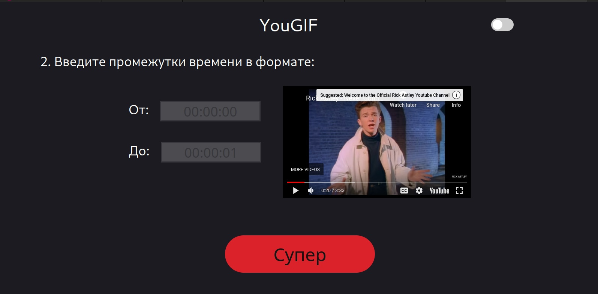
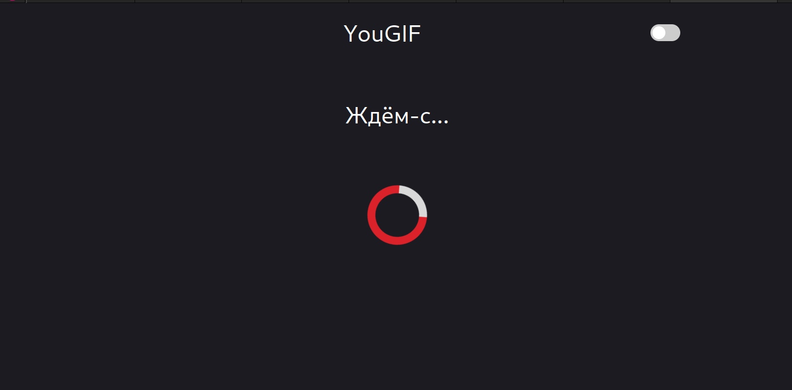
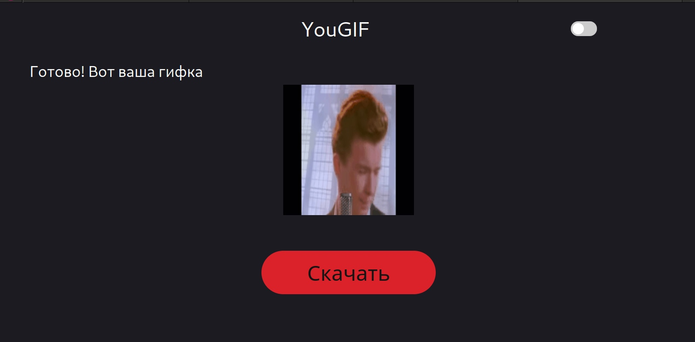

# YouGif

Cервис по созданию GIF файла из YouTube видео.

### Функциональные требования

#### Клиент
* Валидация полей
* Виджет предварительного просмотра видео на YouTube
* Предварительный просмотр GIF
* Панель прогресса
* Темная тема
* Скачивание полученного Gif-файла

#### Сервер
* API endpoints
* Проверка параметров
* Загрузка видео с YouTube
* Преобразование mp4 в gif
* Отправка Gif-файлов на клиент

### Docker

`$ git clone https://github.com/timatifey/yougif.git`

`$ docker-compose build`

`$ docker-compose up`

### Демонстрация работы

### Политика лицензирования 

Apache License, Version 2.0
